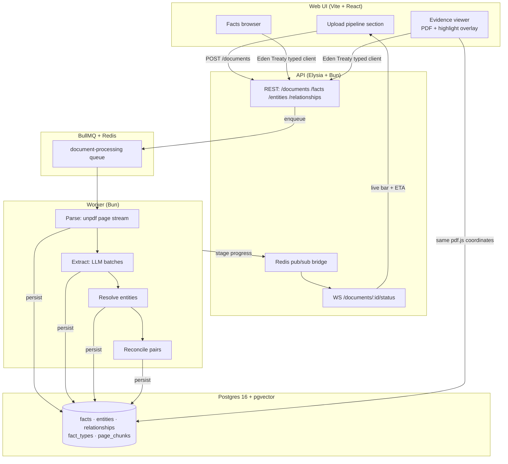

Facts scattered across documents, stated differently, supported elsewhere, or quietly contradicted.
Grounded ingests PDFs, extracts every meaningful claim, grounds each one to its exact source sentence,
and figures out which facts across documents agree, conflict, or only *look* like they conflict —
with the reasoning stored alongside, not just a label.

Built for the Superjoin engineering-intern challenge ([brief](.context/problem.md)).

## Demo Video

> 🎬 **[Demo video (≤ 3 min)](https://youtu.be/LSV2-C85V8s)** 

Live deployment: frontend on Cloudflare Pages, API + worker + Postgres + Redis on a GCP VM behind Traefik/TLS.
at **[grounded.aamn.dev](https://grounded/aamn/dev)**

## Architecture




**Pipeline, per document (incremental — existing facts are never reprocessed):**

1. **Parse** — `unpdf` streams one page at a time (O(1)-page memory), persisting `page_chunks`
  with per-run x/y/width/height position data. Low-text/chart pages render to PNG for vision;
   table-heavy pages stay on the text path first with one vision escalation on weak yield.
2. **Extract** — Gemini Flash-Lite via an OpenAI-compatible gateway, pages packed to an
  output-token budget with `<page n>` markers (never fixed page batches that silently truncate).
   Every fact's `sourceQuote` is string-validated against its own page before storage —
   **no fact without a validated quote**; vision-only facts are stored explicitly flagged.
3. **Resolve** — surface forms clustered by string similarity + pgvector cosine, close matches
  confirmed by a lightweight LLM check before merging into canonical entities.
4. **Reconcile** — cheap-first, two tiers:
  ```mermaid
    flowchart LR
        P[new fact × candidate pair] --> R{rule engine:\nscope · units · multipliers · exact match}
        R -->|decided| S[store relationship\n+ explanation, 0 LLM tokens]
        R -->|ambiguous| J[LLM judge]
        J --> S2["store corroborates |\ncontradicts | reconciled |\nuncertain + reasoning"]
        J -->|judge errors| U[stored as uncertain\nwith error text, never hidden]
  ```


**Key decisions & trade-offs**


| Decision                                          | Why                                                                                                                                   |
| ------------------------------------------------- | ------------------------------------------------------------------------------------------------------------------------------------- |
| Verbatim-quote validation gate                    | Turns hallucinated evidence into flagged facts instead of fake grounding; doubles as the failure detector                             |
| Same pdf.js coordinates backend + frontend        | Backend `unpdf` boxes map directly onto the browser viewer — highlights land on the right sentence, no translation layer              |
| Rules before LLM judge                            | Most corroborations resolve at zero token cost; the judge only sees genuinely ambiguous pairs, and its explanation is the deliverable |
| Dynamic `fact_types` rows, not an enum            | New predicates embed-checked against existing types first; the schema evolves with the documents, no per-type migrations              |
| Incremental ingestion                             | New uploads run only their own stages; reconciliation evaluates only pairs involving new facts                                        |
| pgvector over a dedicated vector DB               | Facts + vectors in one store, no sync logic; plenty at hundreds–thousands of facts                                                    |
| Live WS progress with ETA, verified subscriptions | Worker publishes per-stage progress; a failed subscribe surfaces an error instead of silently stalling                                |


*AI tools used: built with an AI coding agent (Muse Spark via OpenCode), with measured numbers replacing estimates throughout.*

## Setup and Run

Prerequisites: [Bun](https://bun.sh/) ≥ 1.4, [Docker](https://www.docker.com/) + Compose, a Gemini/gateway API key.

```bash
docker compose up -d        # Postgres + pgvector, Redis
bun install
cp .env.example .env        # fill in LLM_API_KEY (and GEMINI_API_KEY)
bun run db:migrate          # pgvector extension + schema
bun run dev                 # api :3000 · worker · web :5173
```

Upload a PDF in the app (sidebar or Documents → Ingestion pipeline) and watch it move through
Parsing → Extracting → Resolving → Reconciling live. Curated one-click cases live in
Overview → Demo Highlights once documents are processed.

## Limitations and Next Steps

- **Contradictions are rare in same-company filings.** Across the starter PDFs the judge reconciled
nearly every ambiguous pair (period/scope differences, not truth differences); the honest
"likely contradiction" exhibit is a top-`uncertain` pair shown with its uncertainty intact.
- **Tables with merged headers** are the known weak spot (text-path linearization can attach a value
to the wrong row). Flagged via confidence + quote-mismatch, surfaced in the UI; the fix is routing
low-confidence table pages through the existing vision path.
- **Judge cost/latency at scale** is fine for a handful of PDFs but would need batching/caching for
"many PDFs" at real scale.
- **Free-tier API keys** may use prompt data for model improvement — use a paid tier/Vertex for
confidential documents.
- Next: footnote/scope linking pass, contradiction-focused multi-company datasets, dashboard-level
precision tracking beyond the fixture spot-check.


## Additional Notes

- `bun test` — 165 keyless unit tests green (54 API + 111 worker), plus DB-backed integration suites.
- `bun x ultracite fix` before committing (Biome formatting/lint).
- Production: `docker-compose.vm.yml` (GCP VM + Traefik) and Cloudflare Pages — see commit history.
- Sample outputs: `spot-check/` (precision summary on fixtures); starter PDFs in `starter-datasets/`.

